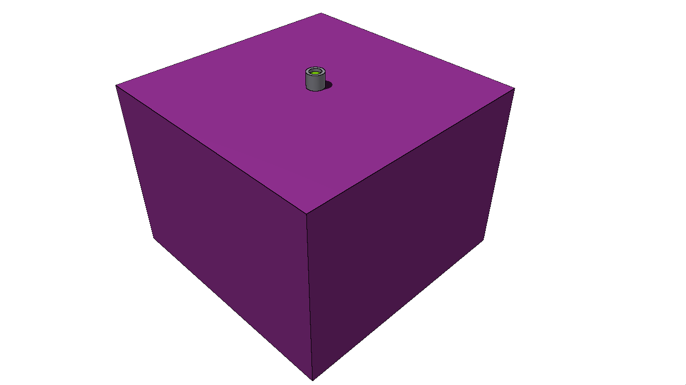

# run su DigitalOcean con 7 * 10^8 decadimenti di es4

## geometria

geometria basata su quella dell'**esercizio 4**

differenze:
- cilindro in polipropilene diventa parallelepipedo (come GEANT)
- cubo d'aria di contenimento più grande (come GEANT)

## sorgente

la sorgente (isotropica), come nella versione originale dell'esercizio 4, specifica la particella `ISOTOPE`: così facendo FLUKA simula il decadimento usando un metodo "puramente Monte Carlo"

## runtime

**~650 eventi / secondo**