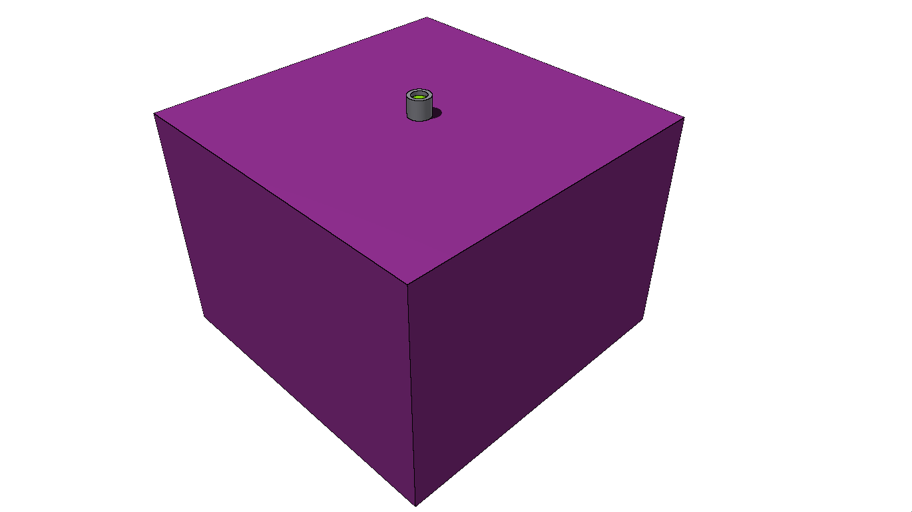

# run su DigitalOcean con 7 * 10^8 decadimenti di es4

## geometria

differenze:
- cilindro in polipropilene diventa parallelepipedo (come GEANT)
- cubo d'aria di contenimento più grande (come GEANT)

## sorgente

la sorgente (isotropica), in questa versione, diversamente dell'esercizio 4, è monoenergetica ed emette fotoni a 661.7 KeV

## runtime

**~2100 eventi / secondo**