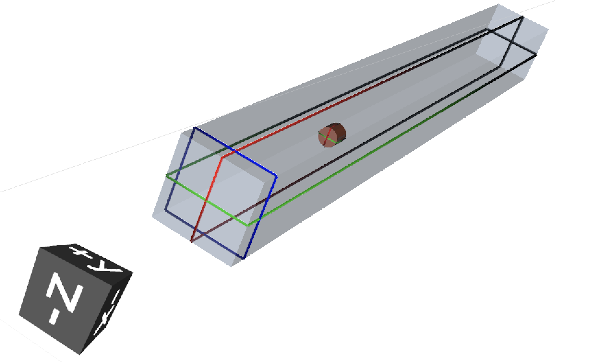

# esercizio 1

Parallelepipedo d'aria contenente:
  - **sorgente** Cs137 puntiforme a emissione isotropa in [0,0,0]
  - **detector** cilindro di raggio 2.53cm e altezza 5.08cm in [0,0,k] con k = {50, 100, 150}

## definizione della sorgente

card [**BEAM**](https://flukafiles.web.cern.ch/manual/chapters/description_input/description_options/beam.html) con:
 - *WHAT(3)* > 2000 pi
 - *SDUM* = ISOTOPE

card [**HI-PROPE**](https://flukafiles.web.cern.ch/manual/chapters/description_input/description_options/hi-prope.html) con:
 - *WHAT(1)* = 55
 - *WHAT(2)* = 137

## definizione della geometria

- parallelepipedo blackhole [**RPP**](https://flukafiles.web.cern.ch/manual/chapters/combinatorial_geometry/combinatorial_geometry_input/body_types/rpp.html) [regione `BLKBODY`]
  - parallelepipedo aria [**RPP**](https://flukafiles.web.cern.ch/manual/chapters/combinatorial_geometry/combinatorial_geometry_input/body_types/rpp.html) [regione `AIR`]
    - cilindretto target [**RCC**](https://flukafiles.web.cern.ch/manual/chapters/combinatorial_geometry/combinatorial_geometry_input/body_types/rcc.html) [regione `TARGET`]

## definizione del detector

 card [**DETECT**](https://flukafiles.web.cern.ch/manual/chapters/description_input/description_options/detect.html) con:
  - *WHAT(1)* = -4096
  - *WHAT(2)* = 1e-8 (o qualsiasi valore prossimo a 0 purché non 0)
  - *WHAT(3)* = 0.001
  - *WHAT(6)* = nome della regione target (`TARGET` in questo caso)

## definizione dei materiali
  - (x2) card [**MATERIAL**](https://flukafiles.web.cern.ch/manual/chapters/description_input/description_options/material.html) per definire cerio e bromo
  - card [**MATERIAL**](https://flukafiles.web.cern.ch/manual/chapters/description_input/description_options/material.html) per definire `CeBr3` come un materiale
  - card [**COMPOUND**](https://flukafiles.web.cern.ch/manual/chapters/description_input/description_options/compound.html) per definire la composizione di `CeBr3`
  - (x3) card [**ASSIGNMA**](https://flukafiles.web.cern.ch/manual/chapters/description_input/description_options/assignma.html) per assegnare *BLCKHOLE*, *AIR* e *CeBr3*, rispettivamente, a `BLKBODY`, `AIR`, `TARGET`

## post-processing dell'output

l'output di *DETECT* è scritto, non formattato, sull'untità fortran 17 (= `fort.17`). Per tirarne fuori una lista si usa `DETSUW` (utility contenuta in *flutil*).
