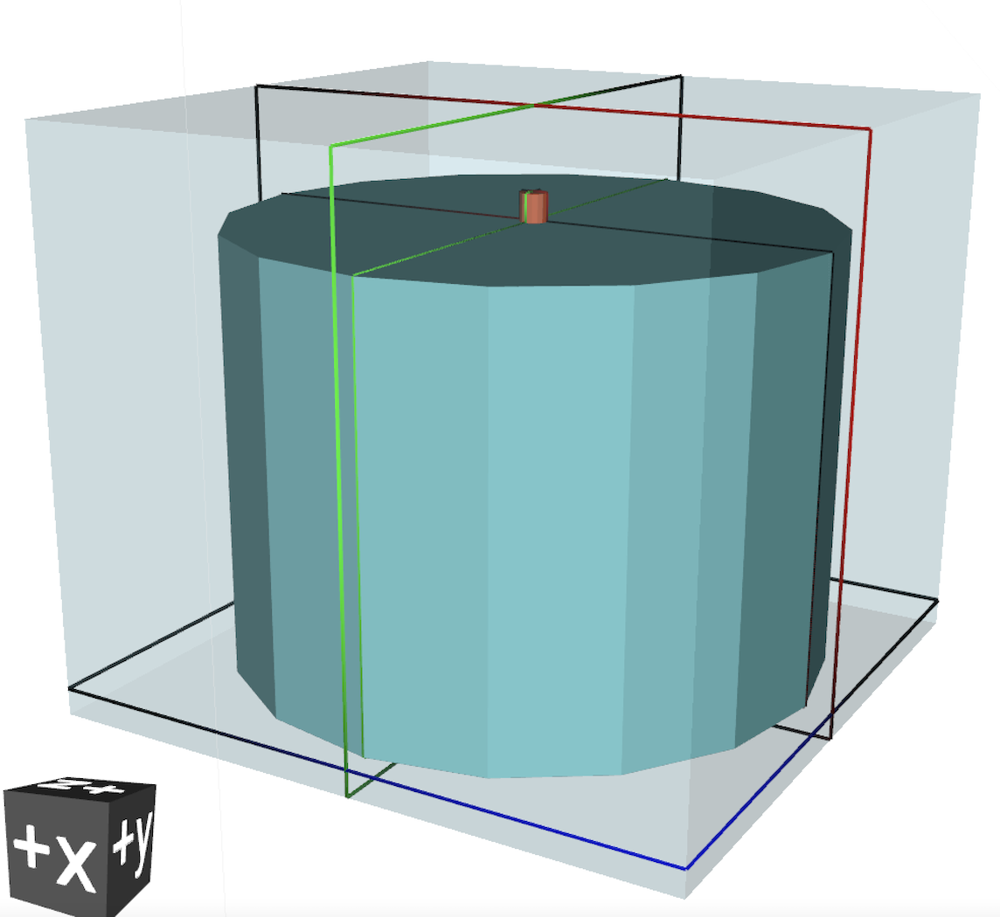

# esercizio 3

Parallelepipedo d'aria contenente:
  - **sorgente** Cs137 di forma cilindrica (di raggio 55cm e altezza 80cm posizionata come il cilindro in polipropilene) a emissione isotropa
  - **cilindro** di raggio 55cm e altezza 80cm in polipropilene in [0,0,0]
  - **detector** cilindro di raggio 2.53cm e altezza 5.08cm in [0,0,80]

## definizione della sorgente

card [**BEAM**](https://flukafiles.web.cern.ch/manual/chapters/description_input/description_options/beam.html) con:
 - *WHAT(3)* > 2000 pi
 - *SDUM* = `ISOTOPE`

card [**BEAMPOS**](https://flukafiles.web.cern.ch/manual/chapters/description_input/description_options/beampos.html) con:
  - *WHAT(1)* = 0
  - *WHAT(2)* = 55
  - *WHAT(3)* = 0
  - *WHAT(4)* = 80
  - *SDUM* = `CYLI-VOL`

card [**HI-PROPE**](https://flukafiles.web.cern.ch/manual/chapters/description_input/description_options/hi-prope.html) con:
 - *WHAT(1)* = 55
 - *WHAT(2)* = 137

## definizione della geometria

- parallelepipedo blackhole [**RPP**](http://www.fluka.org/content/manuals/online/RPP.html) [regione `BLKBODY`]
  - parallelepipedo aria [**RPP**](http://www.fluka.org/content/manuals/online/RPP.html) [regione `AIR`]
    - cilindro polipropilene [**RCC**](http://www.fluka.org/content/manuals/online/RCC.html) [regione `PLASTICA`]
    - cilindretto target [**RCC**](http://www.fluka.org/content/manuals/online/RCC.html) [regione `TARGET`]

## definizione del detector

 card [**DETECT**](http://www.fluka.org/content/manuals/online/DETECT.html) con:
  - *WHAT(1)* = -4096
  - *WHAT(2)* = 1e-8 (o qualsiasi valore prossimo a 0 purché non 0)
  - *WHAT(3)* = 0.001
  - *WHAT(6)* = nome della regione target (`TARGET` in questo caso)

## definizione dei materiali
  - (x2) card [**MATERIAL**](http://www.fluka.org/content/manuals/online/MATERIAL.html) per definire cerio e bromo
  - card [**MATERIAL**](http://www.fluka.org/content/manuals/online/MATERIAL.html) per definire `CeBr3` come un materiale
  - card [**MATERIAL**](http://www.fluka.org/content/manuals/online/MATERIAL.html) per definire `Polyprop` come un materiale
  - card [**COMPOUND**](http://www.fluka.org/content/manuals/online/COMPOUND.html) per definire la composizione di `CeBr3`
  - card [**COMPOUND**](http://www.fluka.org/content/manuals/online/COMPOUND.html) per definire la composizione di `Polyprop`
  - (x4) card [**ASSIGNMA**](http://www.fluka.org/content/manuals/online/ASSIGNMA.html) per assegnare *BLCKHOLE*, *AIR*, *Polyprop* e *CeBr3*, rispettivamente, a `BLKBODY`, `AIR`, `PLASTICA` e `TARGET`

## post-processing dell'output

l'output di *DETECT* è scritto, non formattato, sull'untità fortran 17 (= `fort.17`). Per tirarne fuori una lista si usa `DETSUW` (utility contenuta in *flutil*).
