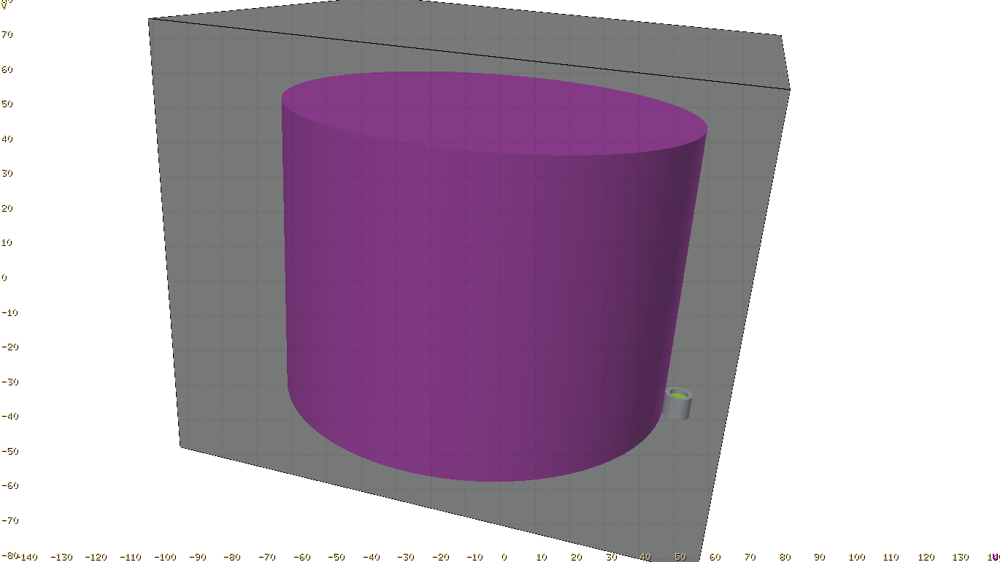

# esercizio 5

Parallelepipedo d'aria contenente:
  - **sorgente** Cs137 di forma cilindrica (di raggio 55cm e altezza 80cm posizionata come il cilindro in polipropilene) a emissione isotropa
  - **cilindro** di raggio 55cm e altezza 80cm in polipropilene in [0,0,0]
  - **detector** cilindro di raggio 2.53cm e altezza 5.08cm in [55 + 3.78,0,0]
  - **schermatura** del detector in piombo posizionata come il detector di spessore 1.25cm e altezza 6.5cm

## definizione della sorgente

card [**BEAM**](https://flukafiles.web.cern.ch/manual/chapters/description_input/description_options/beam.html) con:
 - *WHAT(3)* > 2000 pi
 - *SDUM* = `ISOTOPE`

card [**BEAMPOS**](https://flukafiles.web.cern.ch/manual/chapters/description_input/description_options/beampos.html) con:
  - *WHAT(1)* = 0
  - *WHAT(2)* = 0
  - *WHAT(3)* = 40

card [**BEAMPOS**](https://flukafiles.web.cern.ch/manual/chapters/description_input/description_options/beampos.html) con:
  - *WHAT(1)* = 0
  - *WHAT(2)* = 55
  - *WHAT(3)* = 0
  - *WHAT(4)* = 80
  - *SDUM* = `CYLI-VOL`

card [**HI-PROPE**](https://flukafiles.web.cern.ch/manual/chapters/description_input/description_options/hi-prope.html) con:
 - *WHAT(1)* = 55
 - *WHAT(2)* = 137

## definizione della geometria

- parallelepipedo blackhole [**RPP**](https://flukafiles.web.cern.ch/manual/chapters/combinatorial_geometry/combinatorial_geometry_input/body_types/rpp.html) [regione `BLKBODY`]
  - parallelepipedo aria [**RPP**](https://flukafiles.web.cern.ch/manual/chapters/combinatorial_geometry/combinatorial_geometry_input/body_types/rpp.html) [regione `AIR`]
    - cilindro polipropilene [**RCC**](https://flukafiles.web.cern.ch/manual/chapters/combinatorial_geometry/combinatorial_geometry_input/body_types/rcc.html) [regione `PLASTICA`]
    - cilindretto target [**RCC**](https://flukafiles.web.cern.ch/manual/chapters/combinatorial_geometry/combinatorial_geometry_input/body_types/rcc.html) [regione `TARGET`]
    - cilindro schermatura [**RCC**](https://flukafiles.web.cern.ch/manual/chapters/combinatorial_geometry/combinatorial_geometry_input/body_types/rcc.html) [regione `SHIELD`]
    - cilindro vuoto (schermatura) [**RCC**](https://flukafiles.web.cern.ch/manual/chapters/combinatorial_geometry/combinatorial_geometry_input/body_types/rcc.html) [- regione `SHIELD`]

## definizione del detector

 card [**DETECT**](https://flukafiles.web.cern.ch/manual/chapters/description_input/description_options/detect.html) con:
  - *WHAT(1)* = -4096
  - *WHAT(2)* = 1e-8 (o qualsiasi valore prossimo a 0 purché non 0)
  - *WHAT(3)* = 0.001
  - *WHAT(6)* = nome della regione target (`TARGET` in questo caso)

## definizione dei materiali
  - (x2) card [**MATERIAL**](https://flukafiles.web.cern.ch/manual/chapters/description_input/description_options/material.html) per definire cerio e bromo
  - card [**MATERIAL**](https://flukafiles.web.cern.ch/manual/chapters/description_input/description_options/material.html) per definire `CeBr3` come un materiale
  - card [**MATERIAL**](https://flukafiles.web.cern.ch/manual/chapters/description_input/description_options/material.html) per definire `Polyprop` come un materiale
  - card [**COMPOUND**](https://flukafiles.web.cern.ch/manual/chapters/description_input/description_options/compound.html) per definire la composizione di `CeBr3`
  - card [**COMPOUND**](https://flukafiles.web.cern.ch/manual/chapters/description_input/description_options/compound.html) per definire la composizione di `Polyprop`
  - (x5) card [**ASSIGNMA**](https://flukafiles.web.cern.ch/manual/chapters/description_input/description_options/assignma.html) per assegnare *BLCKHOLE*, *AIR*, *Polyprop*, *LEAD* e *CeBr3*, rispettivamente, a `BLKBODY`, `AIR`, `PLASTICA`, `SHIELD` e `TARGET`

## post-processing dell'output

l'output di *DETECT* è scritto, non formattato, sull'untità fortran 17 (= `fort.17`). Per tirarne fuori una lista si usa `DETSUW` (utility contenuta in *flutil*).
